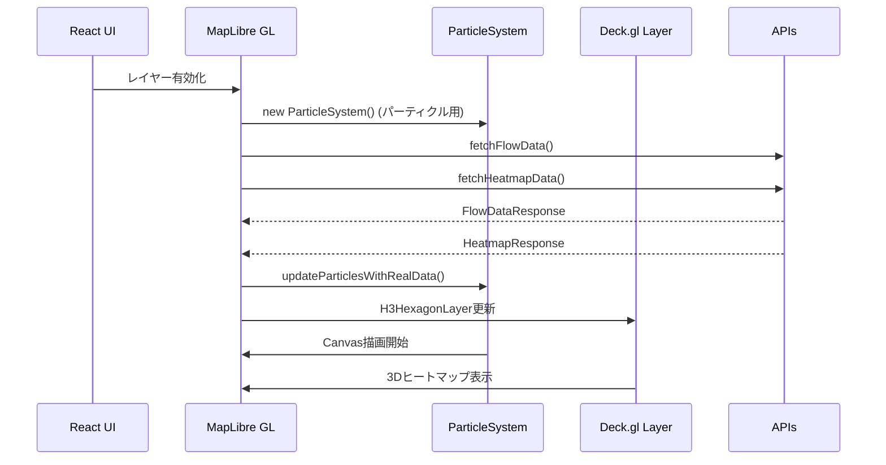
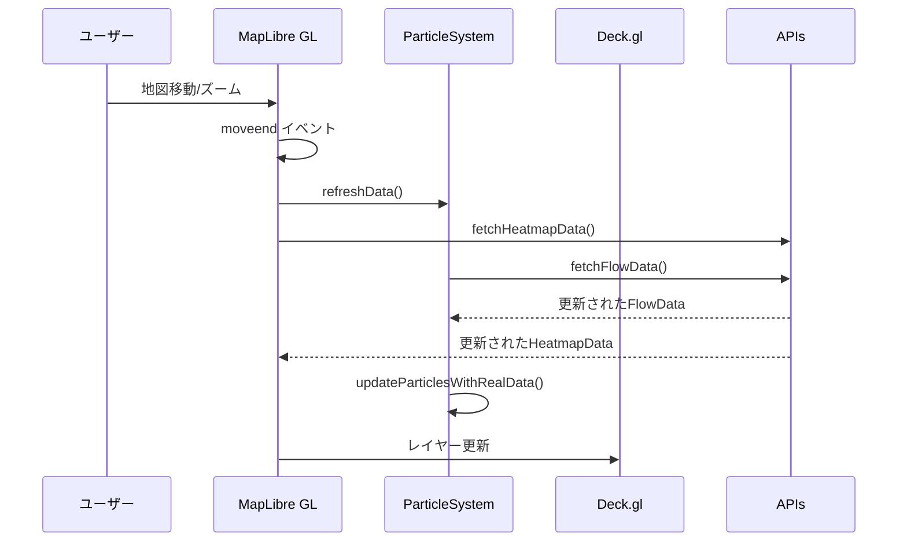

# 人流パーティクル & ヒートマップ API 設定ガイド

## 概要
このプロジェクトでは、以下の2つの可視化機能を提供します：
1. **Canvas overlayを使用したパーティクルシステム**で人流データを可視化
2. **Deck.gl H3HexagonLayer**を使用したヒートマップでエリア密度を可視化

APIから実際のベクターデータとヒートマップデータを取得して、リアルタイムで表示します。

## 🚀 **fetch処理の実装場所**

### 1. 人流パーティクルデータのfetch：`src/Map.tsx`

```typescript
// ParticleSystemクラス内のfetchFlowData()メソッド
private async fetchFlowData() {
  const bounds = this.map.getBounds();
  const zoom = this.map.getZoom();
  
  const apiUrl = `http://localhost:8080/api/v1/flow-vectors/data?` +
    `north=${bounds.getNorth()}&south=${bounds.getSouth()}&` +
    `east=${bounds.getEast()}&west=${bounds.getWest()}&` +
    `zoom=${Math.floor(zoom)}&timestamp=${Date.now()}`;
}
```

### 2. ヒートマップデータのfetch：`src/Map.tsx`

```typescript
// fetchHeatmapData()関数
const fetchHeatmapData = async () => {
  const bounds = map.current.getBounds();
  const currentDate = new Date().toISOString().split('T')[0] + 'T12:00:00';
  
  const apiUrl = `http://localhost:8080/api/v1/heatmap?` +
    `timestamp=${currentDate}&h3Level=8&` +
    `minLat=${bounds.getSouth()}&maxLat=${bounds.getNorth()}&` +
    `minLng=${bounds.getWest()}&maxLng=${bounds.getEast()}&` +
    `timeWindowMinutes=180`;
}
```

### fetch実行タイミング：
1. **初期化時**: マップロード時
2. **地図移動後**: `moveend`イベント発生時
3. **レイヤー有効化時**: ユーザーがトグルをONにした時

## 必要なAPI構成

### 1. 人流ベクターデータエンドポイント
```
GET http://localhost:8080/api/v1/flow-vectors/data
```

#### クエリパラメータ：
- `north`: 表示領域の北端緯度
- `south`: 表示領域の南端緯度  
- `east`: 表示領域の東端経度
- `west`: 表示領域の西端経度
- `zoom`: 現在のズームレベル
- `timestamp`: リクエスト時刻（キャッシュ制御用）

#### レスポンス形式：
```json
{
  "vectors": [
    {
      "x": 256.5,           // ピクセル座標（オプション）
      "y": 128.3,           // ピクセル座標（オプション）
      "u": 0.8,             // x方向速度成分 (-1.0 ～ 1.0)
      "v": -0.3,            // y方向速度成分 (-1.0 ～ 1.0)
      "speed": 0.85,        // 速度の大きさ (0.0 ～ 3.0+)
      "lat": 35.658099,     // 緯度
      "lng": 139.741357     // 経度
    }
  ],
  "timestamp": "2024-01-01T12:00:00Z",
  "bounds": {"north": 35.7, "south": 35.6, "east": 139.8, "west": 139.7}
}
```

### 2. ヒートマップデータエンドポイント（新規追加）
```
GET http://localhost:8080/api/v1/heatmap
```

#### クエリパラメータ：
- `timestamp`: データの基準時刻 (ISO 8601形式)
- `h3Level`: H3グリッドのレベル (通常8)
- `minLat`: 表示領域の南端緯度
- `maxLat`: 表示領域の北端緯度
- `minLng`: 表示領域の西端経度
- `maxLng`: 表示領域の東端経度
- `timeWindowMinutes`: 集計時間窓（分）

#### レスポンス形式：
```json
{
  "timestamp": "2025-03-01T12:00:00",
  "resolution": "h3-8",
  "points": [
    {
      "h3Index": "882e6c2281fffff",
      "lat": 34.349352074074076,
      "lng": 134.1281204814815,
      "intensity": 1,        // 密度レベル (1-100+)
      "value": 27.0         // 実際の値
    }
  ]
}
```

## 🔄 **データフローの詳細**

### 1. 統合された可視化システム


### 2. リアルタイム更新システム


## 🎨 **可視化の詳細**

### パーティクルシステム（Canvas overlay）
- **1,000個のパーティクル**でリアルタイムアニメーション
- **速度に応じた色分け**：青→緑→黄→赤
- **地図と連動**した移動・ズーム対応

### ヒートマップ（Deck.gl H3HexagonLayer）
- **H3グリッドベース**の六角形セル表示
- **3D立体表示**（高さ = intensity × 10）
- **密度に応じた色分け**：緑→黄→オレンジ→赤
- **インタラクティブなtooltip**表示

## 🛠️ **実装のカスタマイズ**

### APIエンドポイントの変更
```typescript
// 人流データ
const apiUrl = `http://your-api-host/api/v1/flow-vectors/data?...`;

// ヒートマップデータ  
const apiUrl = `http://your-api-host/api/v1/heatmap?...`;
```

### ヒートマップの色分け調整
```typescript
getFillColor: (d: HeatmapPoint) => {
  const intensity = d.intensity;
  if (intensity <= 5) return [0, 255, 0, 160];      // 緑: 低密度
  else if (intensity <= 20) return [255, 255, 0, 160]; // 黄: 中密度
  else if (intensity <= 50) return [255, 165, 0, 160]; // オレンジ: 高密度
  else return [255, 0, 0, 160];                     // 赤: 最高密度
}
```

### H3レベルの調整
```typescript
// より詳細な表示：H3レベル9
const apiUrl = `...&h3Level=9&...`;

// より広域な表示：H3レベル7
const apiUrl = `...&h3Level=7&...`;
```

## 🔍 **デバッグとトラブルシューティング**

### ログの確認
ブラウザの開発者ツールで以下のログを確認：

**人流パーティクル**
- `Fetching flow data from: [URL]`
- `Flow data received: X vectors`
- `Updated particles with real data: Y particles`

**ヒートマップ**
- `Fetching heatmap data from: [URL]`
- `Heatmap data received: X points`

### パフォーマンス調整

**パーティクル**
```typescript
// パーティクル数を調整
for (let i = 0; i < 1; i++) { // 各ベクターから1個に減らす

// 更新頻度を調整
particle.x += particle.vx * 0.05; // 速度を半分に
```

**ヒートマップ**
```typescript
// 立体表現を無効化
extruded: false,

// 立体の高さを調整
elevationScale: 10, // デフォルト20から減らす
```

## 📊 **データ形式の例**

### 人流ベクターデータの最小例
```json
{
  "vectors": [
    {"u": 0.5, "v": -0.3, "speed": 0.58, "lat": 35.6581, "lng": 139.7414},
    {"u": -0.2, "v": 0.8, "speed": 0.82, "lat": 35.6585, "lng": 139.7420}
  ],
  "timestamp": "2024-01-01T12:00:00Z"
}
```

### ヒートマップデータの最小例
```json
{
  "timestamp": "2025-03-01T12:00:00",
  "resolution": "h3-8", 
  "points": [
    {"h3Index": "882e6c2281fffff", "lat": 34.349, "lng": 134.128, "intensity": 5, "value": 127.0},
    {"h3Index": "882e6c2283fffff", "lat": 34.349, "lng": 134.122, "intensity": 25, "value": 1186.0}
  ]
}
```

## 🎯 **使用方法**

1. 開発サーバーを起動：`npm run dev`
2. ブラウザでアプリケーションにアクセス
3. 画面下部の制御パネルで機能を有効化：
   - **「人流パーティクルを表示」**：動的なパーティクルアニメーション
   - **「H3ヒートマップを表示」**：3Dヒートマップ表示
4. 地図を移動・ズームすると自動的にデータが更新されます

このように、`fetch`処理は`src/Map.tsx`内で**2つのAPI**に対して実装されており、地図の操作に応じて動的にデータを取得・表示します。 